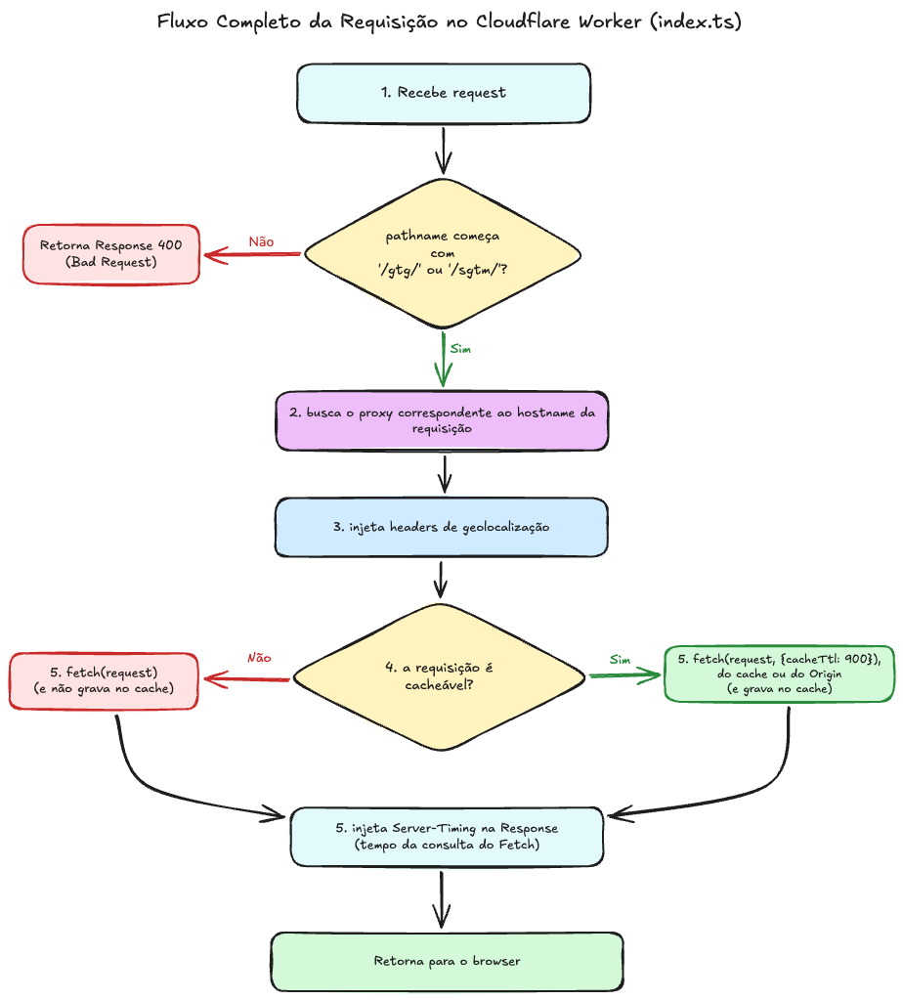

# Google Tag Gateway (GTG) - Cloudflare Worker

Este projeto é um exemplo de implementação do [Google Tag Gateway for Advertisers](https://developers.google.com/tag-platform/tag-manager/gateway/setup-guide?setup=manual#other) utilizando a tecnologia [Cloudflare Workers](https://developers.cloudflare.com/workers/).

## Arquitetura e Fluxo

Para entender melhor como as requisições são roteadas, manipuladas e cacheadas, confira o diagrama de arquitetura:

## Ressalvas Importantes

### Problema de Cache do Proxy GTG e a Variável `cf`

Durante o desenvolvimento do proxy, foi identificado que o cabeçalho `Cache-Control` retornado pelos *endpoints* do GTG não é totalmente compatível ou otimizado para CDNs. Alguns exemplos do comportamento padrão incluem:

*   **Scripts GTM e GTAG:** Retornam `private,max-age=900`, o que impede o cacheamento público na CDN. O ideal para esses ativos é `public,max-age=900`.
*   **Rotas de verificação de saúde (`?validate_geo=healthy` e `healthy`):** Retornam `public`, quando o comportamento correto para garantir dados atualizados seria `no-cache, no-store, must-revalidate`.

#### Como isso foi resolvido?

Para contornar esse problema e forçar o comportamento correto no cache, utilizamos a **variável `cf`** fornecida pela API do Cloudflare Workers na função `fetch()`. A propriedade `cf.cacheControl` permite sobrescrever as regras de cache padrão do Cloudflare. 

No código (ver função `getCachePolicy`), nós mapeamos as requisições do GTG e definimos a política adequada de cache através do parâmetro `cf`:

*   **Contêineres GTG:** Forçamos o cache por 15 minutos.
*   **Service Workers do GTG:** Forçamos o cache por 1 ano.
*   **Health Checks:** Desativamos o cache.

> **Nota sobre o sGTM:** Esse problema não afeta o sGTM (Server-side Google Tag Manager). O sGTM já envia o cabeçalho `Cache-Control` correto nas respostas de eventos, telemetria e Service Worker, não necessitando de intervenção com a propriedade `cf`.
